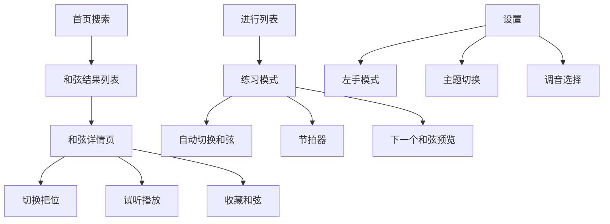

## 1. 产品概述

吉他和弦指法交互图谱是一款面向吉他学习者的在线学习工具，帮助用户快速查询和弦指法、试听和弦音色、练习常用和弦进行，提升吉他学习效率。

- **目标用户**：吉他初学者、中级学习者、音乐爱好者
- **核心价值**：直观的指板可视化、多把位指法展示、互动试听、进行式练习
- **产品定位**：轻量级、高颜值、功能完善的吉他学习辅助工具

## 2. 核心功能

### 2.1 用户角色
| 角色 | 注册方式 | 核心权限 |
|------|----------|----------|
| 普通用户 | 无需注册，直接使用 | 浏览和弦、试听、练习、本地收藏 |

### 2.2 功能模块
1. **搜索首页**：和弦搜索、快速入口、热门和弦推荐
2. **和弦详情页**：多把位指法图、指板可视化、试听播放
3. **进行列表页**：预设和弦进行浏览、自定义进行创建
4. **进行练习页**：自动切换和弦、节拍器、下一个和弦预览
5. **收藏页**：收藏的和弦与进行管理
6. **设置页**：左手模式、主题切换、调音调优
7. **帮助页**：指法图阅读说明、和弦命名规则

### 2.3 页面详情
| 页面名称 | 模块名称 | 功能描述 |
|----------|----------|----------|
| 搜索首页 | 搜索框 | 根音+和弦类型组合搜索，支持拼音/英文 |
| 搜索首页 | 快速入口 | 常用和弦快捷按钮（C、G、Am、F等） |
| 搜索首页 | 热门推荐 | 展示常用和弦卡片列表 |
| 和弦详情 | 指板SVG | 6弦×品格可视化，显示手指编号、空弦/闷音、横按 |
| 和弦详情 | 把位切换 | 左右箭头切换同一和弦不同把位指法 |
| 和弦详情 | 试听控制 | 播放/暂停、扫弦/分解模式、音量、BPM调节 |
| 进行列表 | 预设进行 | 12套常用和弦进行卡片展示 |
| 进行列表 | 自定义 | 用户创建、编辑、删除自定义进行 |
| 进行练习 | 练习面板 | 大尺寸和弦图、自动切换、当前拍高亮 |
| 进行练习 | 预览窗口 | 显示下一个和弦的小尺寸预览 |
| 进行练习 | 节拍器 | 可视化节拍指示、可调节拍速度 |
| 收藏页 | 和弦收藏 | 收藏的和弦网格展示，点击跳转详情 |
| 收藏页 | 进行收藏 | 收藏的进行列表，点击进入练习 |
| 设置页 | 显示设置 | 左手模式（镜像指板）、亮/暗主题切换 |
| 设置页 | 调音设置 | 标准EADGBE、降半音等调音选项 |
| 帮助页 | 指法说明 | 如何阅读和弦指法图的详细说明 |
| 帮助页 | 命名规则 | 和弦命名规则解释（可折叠） |

## 3. 核心流程

### 3.1 和弦查询流程
用户在搜索框输入和弦名（如 Cmaj7）→ 系统匹配和弦数据 → 展示搜索结果卡片 → 用户点击进入详情 → 查看指板图 → 可切换把位 → 点击播放试听

### 3.2 进行练习流程
用户进入进行列表 → 选择预设进行或自定义进行 → 进入练习模式 → 调节BPM和音量 → 开始播放 → 自动切换和弦 → 查看下一个和弦预览 → 循环练习

### 3.3 收藏管理流程
用户在和弦详情页点击收藏 → 保存到 localStorage → 收藏页展示 → 可取消收藏 → 数据持久化保存

## 4. 用户界面设计

### 4.1 设计风格
- **主色调**：温暖的琥珀棕色系（#8B5A2B、#D4A574），呼应木质吉他的质感
- **辅助色**：深酒红（#722F37）作为强调色，用于按钮和高亮
- **中性色**：米白色背景（#FAF7F2）、深棕文字（#2D2420）
- **按钮风格**：圆角矩形，轻微阴影，hover时有上浮效果
- **字体**：标题使用优雅的衬线字体（如 Playfair Display），正文使用清晰的无衬线字体（如 Inter）
- **布局风格**：卡片式布局，柔和阴影，温暖木质纹理背景
- **图标风格**：线性图标，使用 Lucide 图标库

### 4.2 页面设计概述
| 页面名称 | 模块名称 | UI 元素 |
|----------|----------|---------|
| 搜索首页 | Hero区域 | 大标题、搜索框、木纹背景、渐入动画 |
| 搜索首页 | 快速和弦 | 圆形按钮网格，hover放大效果 |
| 搜索首页 | 热门推荐 | 卡片横向滑动，显示和弦名和小指板图 |
| 和弦详情 | 指板区域 | 大号SVG指板，居中展示，有投影效果 |
| 和弦详情 | 控制栏 | 播放按钮、模式切换、音量滑块、BPM调节 |
| 和弦详情 | 把位选择 | 横向排列的把位标签，当前选中高亮 |
| 进行练习 | 主和弦区 | 超大号指板图，当前拍脉冲动画 |
| 进行练习 | 预览区 | 右侧小窗显示下一个和弦，半透明效果 |
| 进行练习 | 进度条 | 底部进度条显示当前进行位置 |
| 设置页 | 设置项 | 分组卡片，开关/选择器，左对齐标签 |

### 4.3 响应式
- **桌面优先**设计，适配 1280px 及以上
- **平板适配**：768px - 1024px，两栏变单栏
- **手机适配**：375px - 767px，单列布局，优化触控区域
- **触控优化**：按钮最小 44px 高度，手势支持滑动切换把位

### 4.4 动效与交互
- 页面加载：元素交错渐入（staggered fade-in）
- 指板切换：平滑过渡（crossfade）
- 播放状态：节拍脉冲动画（pulse）
- 悬停效果：按钮上浮、阴影加深
- 和弦切换：淡入淡出 + 轻微缩放
