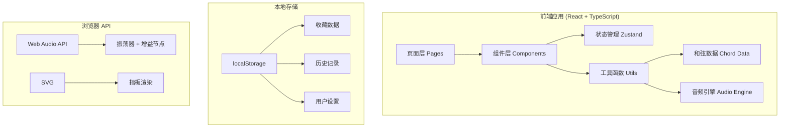

## 1. 架构设计



## 2. 技术选型

- **前端框架**：React 18 + TypeScript
- **构建工具**：Vite 5
- **样式方案**：Tailwind CSS 3
- **状态管理**：Zustand
- **路由**：React Router v6
- **图标库**：Lucide React
- **音频**：Web Audio API（原生实现，无需第三方库）
- **数据存储**：localStorage
- **包管理器**：npm

## 3. 路由定义

| 路由 | 页面 | 功能描述 |
|------|------|----------|
| `/` | 搜索首页 | 和弦搜索、快速入口、热门推荐 |
| `/chord/:symbol` | 和弦详情 | 指板图、多把位切换、试听播放 |
| `/progressions` | 进行列表 | 预设进行展示、自定义进行管理 |
| `/progressions/:id` | 练习模式 | 自动切换、节拍器、和弦预览 |
| `/favorites` | 收藏页 | 收藏和弦与进行的管理 |
| `/settings` | 设置页 | 左手模式、主题、调音设置 |
| `/help` | 帮助页 | 指法说明、命名规则 |

## 4. 数据模型

### 4.1 和弦数据模型

```typescript
interface ChordPosition {
  name: string;           // 把位名称: "open", "1st", "2nd", etc.
  frets: number[];        // 6弦品格数，-1=mute, 0=open, 1+=fret number
  fingers: (number | null)[]; // 手指编号 1-4 或 null
  barre?: {               // 横按（可选）
    fromString: number;   // 起始弦 1-6
    toString: number;     // 结束弦 1-6
    fret: number;         // 品格
  };
}

interface Chord {
  id: string;             // 唯一标识，如 "Cmaj7"
  root: string;           // 根音: "C", "C#", "D", etc.
  quality: string;        // 和弦类型: "maj", "min", "7", "m7", "maj7", etc.
  symbol: string;         // 显示符号: "Cmaj7"
  positions: ChordPosition[];
}
```

### 4.2 和弦进行模型

```typescript
interface Progression {
  id: string;
  name: string;
  chords: string[];       // 和弦符号数组，如 ["C", "G", "Am", "F"]
  isCustom?: boolean;
}
```

### 4.3 用户设置模型

```typescript
interface UserSettings {
  leftHanded: boolean;    // 左手模式
  theme: 'light' | 'dark';
  tuning: string;         // 调音名称: 'standard', 'half-step-down'
  volume: number;         // 音量 0-1
  bpm: number;            // 拍速
  playMode: 'strum' | 'arpeggio'; // 扫弦/分解
}
```

### 4.4 收藏与历史

```typescript
interface FavoriteItem {
  id: string;
  type: 'chord' | 'progression';
  addedAt: number;
}

interface HistoryItem {
  id: string;
  type: 'chord';
  viewedAt: number;
}
```

## 5. 核心模块

### 5.1 和弦数据库
- 预置常用和弦数据（maj, min, 7, m7, maj7, sus2, sus4, dim, aug）
- 每个和弦包含多个把位（open, 1st, 2nd, 3rd等）
- 支持所有12个根音

### 5.2 音频引擎
- 使用 Web Audio API 实现
- OscillatorNode 生成正弦/三角波模拟吉他音色
- GainNode 控制音量和 ADSR 包络
- 支持扫弦（快速依次触发各弦）和分解（慢速琶音）

### 5.3 指板渲染
- SVG 绘制 6弦 × N品格指板
- 支持手指编号圆点
- 空弦 O / 闷音 X 标记
- 横按条绘制
- 左手模式镜像翻转

### 5.4 状态管理
- Zustand store 管理全局状态
- 设置状态持久化到 localStorage
- 收藏和历史记录管理

## 6. 项目目录结构

```
src/
├── components/           # 可复用组件
│   ├── Fretboard.tsx     # 指板SVG组件
│   ├── ChordCard.tsx     # 和弦卡片
│   ├── SearchBar.tsx     # 搜索栏
│   ├── AudioControls.tsx # 音频控制
│   ├── Navbar.tsx        # 导航栏
│   └── ...
├── pages/                # 页面组件
│   ├── Home.tsx          # 首页
│   ├── ChordDetail.tsx   # 和弦详情
│   ├── Progressions.tsx  # 进行列表
│   ├── Practice.tsx      # 练习模式
│   ├── Favorites.tsx     # 收藏页
│   ├── Settings.tsx      # 设置页
│   └── Help.tsx          # 帮助页
├── store/                # Zustand stores
│   ├── useSettingsStore.ts
│   ├── useFavoritesStore.ts
│   └── useHistoryStore.ts
├── data/                 # 静态数据
│   └── chords.ts         # 和弦数据库
├── utils/                # 工具函数
│   ├── audio.ts          # 音频引擎
│   ├── chordUtils.ts     # 和弦工具函数
│   └── storage.ts        # 本地存储
├── types/                # TypeScript类型
│   └── index.ts
├── App.tsx
├── main.tsx
└── index.css
```

## 7. 和弦数据库内容

### 7.1 和弦类型
- maj (大三和弦)
- min (小三和弦)
- 7 (属七和弦)
- m7 (小七和弦)
- maj7 (大七和弦)
- sus2 (挂二和弦)
- sus4 (挂四和弦)
- dim (减三和弦)
- aug (增三和弦)

### 7.2 12个根音
C, C#, D, D#, E, F, F#, G, G#, A, A#, B

### 7.3 预设和弦进行（12套）
1. C - G - Am - F (I-V-vi-IV)
2. G - D - Em - C
3. D - A - Bm - G
4. A - E - F#m - D
5. E - B - C#m - A
6. F - C - Dm - Bb
7. Am - F - C - G (vi-IV-I-V)
8. Em - C - G - D
9. Bm - G - D - A
10. C - Am - F - G
11. G - Em - C - D
12. D - Bm - G - A

## 8. 性能与体验

- 所有和弦数据内置，无需网络请求
- SVG 指板高性能渲染
- 音频使用 Web Audio API 低延迟
- 状态持久化使用 localStorage 同步读写
- 响应式设计适配多种设备
- 平滑过渡动画提升用户体验
